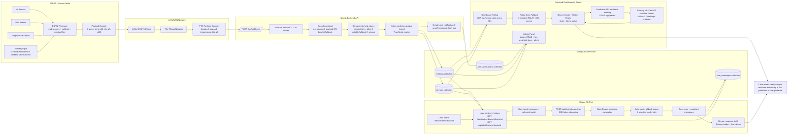

# JalRakshak.AI End-to-End Project Flow

```mermaid
flowchart LR
  %% =========================
  %% 1) EDGE DEVICE LAYER
  %% =========================
  subgraph EDGE[ESP32 + Sensor Node]
    S1[pH Sensor]
    S2[TDS Sensor]
    S3[Temperature Sensor]
    S4[Turbidity Input<br/>currently simulated in backend when absent]
    E1[ESP32 Firmware<br/>read sensors + calibrate + median filter]
    E2[Payload Encode<br/>6 bytes: temp x10, tds, ph x100]
    S1 --> E1
    S2 --> E1
    S3 --> E1
    S4 --> E1
    E1 --> E2
  end

  %% =========================
  %% 2) LORAWAN + TTN
  %% =========================
  subgraph LORA[LoRaWAN Network]
    L1[LoRa SX1276 Uplink]
    L2[The Things Network]
    L3[TTN Payload Decoder<br/>decoded_payload: temperature, tds, ph]
    E2 --> L1 --> L2 --> L3
  end

  %% =========================
  %% 3) INGESTION BACKEND
  %% =========================
  subgraph BACKEND[Next.js Backend API]
    W1[/POST /api/webhook/]
    W2[Validate optional X-TTN-Secret]
    W3[Decode payload<br/>use decoded_payload OR base64 fallback]
    W4[Compute derived values<br/>conductivity = tds x 2<br/>turbidity fallback if missing]
    W5[Inline prediction during ingest<br/>TypeScript engine]
    W6[Create alert notification if unsafe/moderate-high risk]
    L3 --> W1 --> W2 --> W3 --> W4 --> W5 --> W6
  end

  %% =========================
  %% 4) DATA LAYER
  %% =========================
  subgraph DB[MongoDB via Prisma]
    D1[(readings collection)]
    D2[(devices collection)]
    D3[(alert_notifications collection)]
    D4[(chat_messages collection)]
  end

  W5 --> D1
  W5 --> D2
  W6 --> D3

  %% =========================
  %% 5) DASHBOARD + ANALYTICS
  %% =========================
  subgraph UI[Frontend Dashboard + Admin]
    U1[Dashboard Polling<br/>GET /api/sensor-data every 30s]
    U2[Relay Sync Fallback<br/>if needed: RELAY_URL source]
    U3[Device Cards + History Charts<br/>stats + latest status]
    U4[Prediction API per latest reading<br/>POST /api/predict]
    U5[Primary ML: FastAPI Random Forest<br/>fallback: TypeScript predictor]
    U6[Admin Panel<br/>device CRUD + live webhook logs + alerts]
  end

  D1 --> U1
  D2 --> U1
  U1 --> U2 --> U3
  U3 --> U4 --> U5 --> U3
  D3 --> U6
  D1 --> U6
  D2 --> U6

  %% =========================
  %% 6) AI CHAT WORKFLOW
  %% =========================
  subgraph CHAT[Device AI Chat]
    C1[User opens /device/:deviceId/chat]
    C2[Load context + history<br/>GET /api/device/:deviceId/context<br/>GET /api/chat/history/:deviceId]
    C3[User sends message + selected model]
    C4[POST /api/chat stream=true<br/>SSE token streaming]
    C5[OpenRouter streaming completion]
    C6[Auto model fallback queue<br/>if selected model fails]
    C7[Save user + assistant messages]
    C8[Stream response to UI<br/>thinking loader + live tokens]
  end

  D1 --> C2
  D2 --> C2
  D4 --> C2
  C1 --> C2 --> C3 --> C4 --> C5 --> C6 --> C7 --> C8
  C7 --> D4

  %% =========================
  %% 7) USER VALUE
  %% =========================
  OUT[Clear water safety insights<br/>real-time monitoring + risk prediction + chat guidance]
  U3 --> OUT
  C8 --> OUT
```
